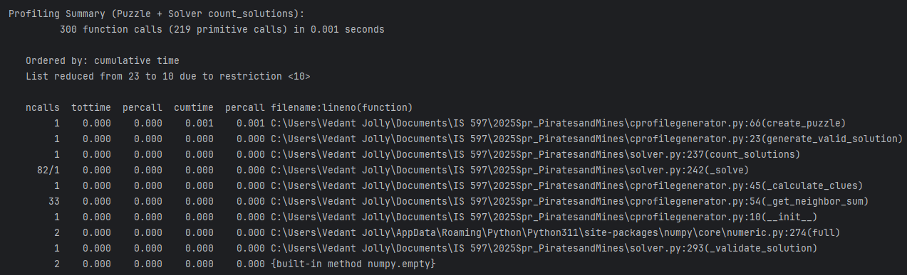

# Pirates and Mines

# Puzzle Overview

In this puzzle, you are given a grid of possible sizes 4x4 to 9x9. In the grid, there are numbers and empty squares. Similar to mindsweeper, the numbers are clues to placement of landmines! Unlike mindsweeper, cells in the grid do not move, and there is also the potential to gain treasure! The objective of the puzzle is to figure out which empty cells are landmines, and which are treasure. 

To solve the puzzle, you use the given number clues to deterministically solve the positions of the mines and treasure squares. For each clue cell, the clue is a sum of the landmines (-1) and treasures (+1) surronding that particular clue cell in all orthogonal directions (up, down, left, right). For instance, a clue of 0 could mean that cell is surronded by two treasures (+2) and two landmines (-2)  2-2= 0. 

# Python Scripts in the Repo

## Puzzle Generation
This script creates a completed/fully solved puzzle with clues and landmines and treasures filled in, and subsequently removes the landmines and treasures in order to create a puzzle without an answer key. This solver also checks to make sure that there is only one valid solution for the generated puzzle by iterating recursively to see if there is any solution for the puzzle that hasn't already been recorded in its potential solution list.

## Toggle puzzle size and difficulty
Our scripts can generate varying puzzle sizes and difficulties.
### Difficulty
#### Easy
#### Medium
#### Hard

### Puzzle Size
The puzzle can be toggled to any size from 4x4 to 9x9.

## Solver Script (And Algorithm)
Our solver script takes an unsolved puzzle and uses a brute force technique to discover the solution. It fills all of the empty cells with treasure, checks to see if any rules/clues are no longer possible/valid with the configuration present after adding the last treasure it input, and then decides whether to change it to a landmine instead. It also uses backtracking to ensure that all clues remain valid.

## Data Structure
We chose to utilize an array to represent our puzzle due to it being convenient for representing and mapping the grid structure of our puzzle. Each cell has a coordinate x,y pair corresponding to its position in the grid, and allowing us to update the array of our puzzle.

# Puzzle Analysis

## Targeted Algorithm Analysis
When sorted by "Own Time" in the PyCharm Profiler, it looks like 

create_puzzle (0.001 s)

Dominant cost for this small 9×9 puzzle. Includes random fill, clue computation, and a full uniqueness check.

_solve recursion (82 calls)

The backtracking solver is naturally the hotspot—each empty cell branches two ways and validates adjacent clues.

Clue functions (_calculate_clues & _get_neighbor_sum)

Even though they’re lightweight here, they’ll scale as O(n²) for an n×n grid.

Optimization Suggestions
Early Pruning in Solver
Stop exploring a branch as soon as a clue check fails, rather than validating all neighbors.

Memoize Neighbor Sums
Cache results of _calculate_clue for cells whose neighborhood hasn’t changed.

Vectorize Clue Calculation
For initial clue grid, consider NumPy convolution with a kernel [[0,1,0],[1,0,1],[0,1,0]], mapping 't'→+1, 'l'→−1.

Limit Uniqueness Checks
If only >1 solution matters, modify count_solutions() to bail out as soon as solution_count > 1

## Big O Analysis
Our algorithm for the solver would be O(N) or O(N^2) because as the puzzle grid size increases, the puzzle seems to actually being solved faster???

When you instantiate the PuzzleGenerator, you allocate two full n×n arrays (self.grid and self.clue_grid), so construction costs O(n²) time and O(n²) space. Filling the grid randomly and computing every clue via _calculate_clues() also takes exactly one pass over all n² cells; since each cell’s neighbor sum inspects only its four orthogonal neighbors, each is constant-time work, and the entire clue computation remains O(n²). The create_puzzle() method simply wraps these O(n²) steps and then calls generate_valid_solution(), which itself does one random-fill pass (O(n²)), one clue pass (O(n²)), and then hands off to the solver to verify uniqueness.

That hand‐off is critical: PuzzleSolver.count_solutions() is a pure backtracking routine over each of the k unknown cells. At each “?” cell it branches in two directions (“t” or “l”), so in the worst case it explores on the order of 2ᵏ partial grids. At each placement it does a constant-time validity check of up to four neighboring clues, and—if you choose to validate the completed grid at the leaves—another O(n²) pass. Altogether, the solver runs in O(2ᵏ · n²) time, with O(k) recursion‐stack space (plus whatever it takes to store any solutions you append).

Because your generator repeatedly invokes this exponential‐time solver until exactly one solution remains, the overall time complexity of puzzle creation is dominated by that backtracking check: on the order of 2ᵏ · n², which is exponential in the number of unknown cells. All of the other methods—initialization, clue computation, neighbor‐summing—are polynomial (O(n²) or O(1)) and become relatively insignificant once k grows.

--------------

# 2025 Spring Final Projects

Each project from this semester is a public fork linked from this repository.  This is just one of the many assignments students worked on for the course, but this is the *only* one they are permitted to publish openly.

## Final Project Expectations:

You have considerable flexibility about specifics and you will publish your project openly (as a fork from here) to allow making it part of your portfolio if you choose.  You may work alone or in a team of two students. 

Regardless of topic, it must involve notable amounts of original work of your own, though it can of course use existing libraries or be inspired by or built upon some other published work(s). 

PLAGIARISM IS NOT ACCEPTABLE. From the first commit through all production of documentation and code, it must be crystal clear which, if any, parts of the project were based on or duplicated from any other source(s) all of which must be cited. Use of generative AI systems must be cited for the same reasons, typically by documenting prompts used.  This should be so specific that any evaluator can tell which lines of code are original work and which aren't. Same for all written narrative, documentation, images, significant algorithms, etc.

## Project Types you may choose:

(Making original _variations_ of puzzles and games isn't as difficult as it may seem -- we have already done this in class. _Though admittedly, making *good* game variations -- that are well-balanced, strategically interesting, with good replay value_ can take expertise or luck and play-testing with revisions.  Such balanced elegance is desirable but might not be achievable here, given the short time you have.)

1. Devise your own new _original_ type of logic puzzle or an _original variation_ of existing puzzle type. Like with previous homework, your program should be able to randomly generate new puzzles of your type and automatically verify that all puzzles generated comply with the standard meta-rule that only one valid solution exists. It needs to output the _unsolved_ puzzles in a way that a human can print or view them conveniently to try solving them and to somehow output (to file?) or display the solution for each puzzle when requested, so as not to spoil the challenge. An interactive UI to "play" the puzzles interactively is very nice but *not* required. 

2. OR develop an AI game player for an _original variation_ of some existing strategy game.  If you do this, it needs to be set up so it can either play computer-vs-computer and/or against human players with a reasonable text or graphical UI. 2B. If two teams want to independently develop AI players for the same type of game variant as each other (but using different algorithms, strategies, and/or data structures) so they can compete, that is okay.  A sub-variation is to enable this game type on our course game server, discuss with the instructor if this is of interest.

## Deliverables and other Requirements:

* Have some fun!
* In your own fork, please replace this README.md file's contents with a good introduction to your own project. 
* Targeted Algorithm Analysis:  Regardless of which option you choose, you need to _describe the performance characteristics of some critical parts of your program and explain why you chose the data structures and core algorithm(s) you did_. Examples, if you chose Type #1, what's the Big-O, Big-Theta, or Big-Omega run-time complexity of your puzzle solver? Or the puzzle generator? If you're doing Type #2 and using minimax or negamax, what's the complexity of your _heuristic evaluation function_? ...and of the function that finds all legal moves from a game state? 
* Performance Measurement: Supplement the analysis above with run-time measurements of multiple iterations of the game or puzzles as discussed in class. Sample results from a run-time profiler is a good idea at least as part of the measurements.
* If your team has more than one student, we expect everyone to make substantial git commits, with all members working on the programming. In addition, your README documentation should include a summary of how you shared the work.
* Live in-class presentation & demonstration of your work.
